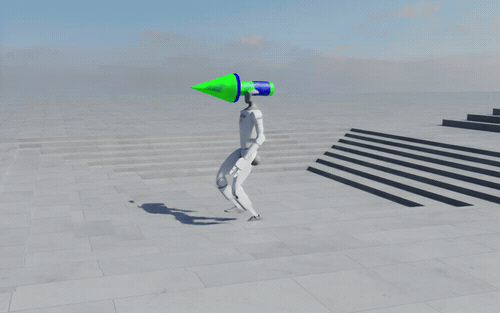
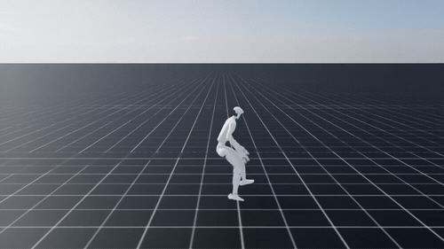
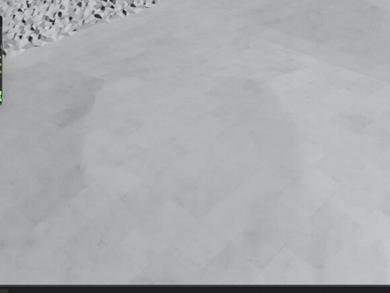
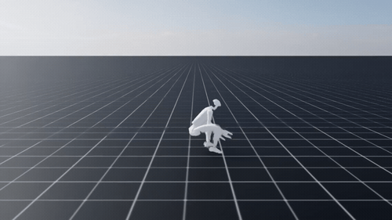
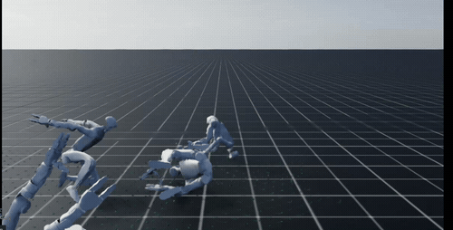
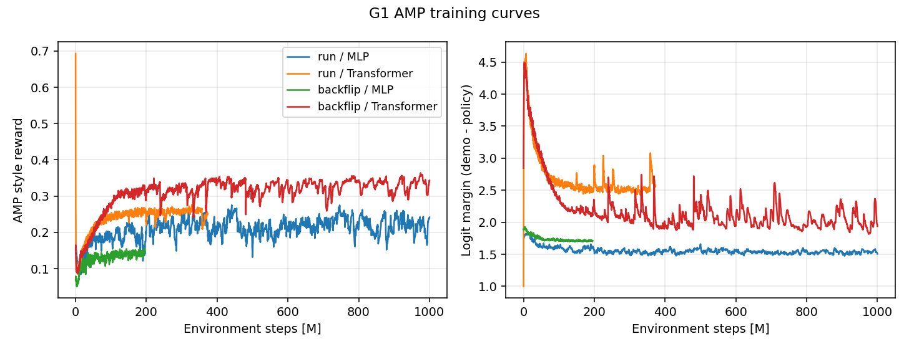
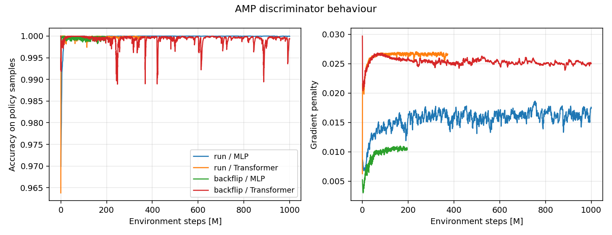

# ProtoMotions（G1 / AMP 拡張フォーク）

物理シミュレーション上のヒューマノイドに、モーションキャプチャから「歩き方・跳び方」などの動きの分布を学習させる、模倣学習＋強化学習の研究・実験コードです。

本リポジトリは [NVLabs/ProtoMotions](https://github.com/NVLabs/ProtoMotions) をベースに、**Unitree G1** への適用と **Adversarial Motion Priors (AMP)** の再現・調整を中心に拡張しています。

---

## 成果物（デモ）

学習させた方策を評価したときの挙動です。**うまくいった動作と、うまくいかなかった動作の両方**を載せています。

### 歩行 + 目標方向追従（成功）



頭上の矢印が方策に与えている目標進行方向です。段差や階段のある地形の上で、指示された方向へ向き直りながら歩行を維持できています。上体の姿勢も崩れておらず、モーションキャプチャ由来のスタイルが保たれています。

### 走行（部分的に成功）



Transformer 版の走行方策です。**最初の 2〜3 秒は腕振りと脚の入れ替えを伴う自然な走りが出ています**が、その後バランスを崩して接地姿勢に落ち込み、そこから復帰できません。参照モーションの走行フェーズは真似できているものの、周期を継続させる安定性が足りていない状態です。



同じ走行タスクで観測された失敗パターンです。地面を蹴って進む代わりに、**ほぼ水平の姿勢で滞空して滑るように移動する**挙動を獲得してしまっています。影と機体が大きく離れていることから、接地せずに進んでいることが分かります。スタイル報酬だけでは「見た目が参照モーションに近ければよい」方向に最適化が逃げうる、という AMP の弱点が出た例です。

### バックフリップ（失敗）



**踏み切りと空中での回転までは成立していますが、着地で潰れてそのまま復帰できません。** 回転の入力自体は学習できている一方、着地衝撃を吸収する脚の伸展タイミングが合っていないことが原因と考えられます。



学習中の様子です。複数環境を並列に走らせており、多くの試行が転倒に終わる中から徐々に回転動作が獲得されていきます。

上の GIF は `protomotions/scripts/make_readme_gifs.py` で元動画から切り出しています。元の mp4 / webm はリポジトリには含めていません。

---

## 開発の背景・目的

ヒューマノイドの運動制御では、タスク報酬だけだと「目的は達成するが動きが不自然」になりやすいです。AMP は、参照モーションの分布に近いスタイルを識別器で学習し、方策の報酬に乗せることで、自然な歩行・アクロバット動作を獲得する手法です。

本プロジェクトでは次を目的としました。

1. 研究用キャラクタ（SMPL / AMP humanoid）ではなく、実機に近い **Unitree G1** で AMP を動かす。
2. BVH / AMASS から G1 関節への **リターゲティング** を通し、バックフリップ等の難易度の高い動作を学習データにする。
3. G1 の関節数に合わせて **識別器の正則化** を調整し、歩行・走行・バックフリップで学習の安定性を検証する。

---

## 使用技術


| 領域           | 技術                                                             | バージョン目安                                       |
| ------------ | -------------------------------------------------------------- | --------------------------------------------- |
| 言語           | Python                                                         | 3.10 推奨（Genesis 公式要件に合わせる場合）                  |
| 深層学習         | PyTorch                                                        | IsaacGym: `2.2` / IsaacLab・Genesis: `2.5.0` 系 |
| 学習ループ        | PyTorch Lightning Fabric                                       | IsaacGym: `2.3.3` / IsaacLab: `2.5.0.post0`   |
| 設定           | Hydra / OmegaConf                                              | `hydra-core` 1.2〜1.3                          |
| アルゴリズム       | PPO、AMP、ASE、DeepMimic 系、MaskedMimic                            | 上流実装＋本フォークの AMP 調整                            |
| シミュレータ       | NVIDIA Isaac Gym / Isaac Lab、Genesis                           | いずれか 1 つを選択                                   |
| 実験管理         | Weights & Biases                                               | `wandb` 0.19 系                                |
| 人体モデル・リターゲット | SMPL/SMPL-X、PoseLib、[Mink](https://github.com/kevinzakka/mink) | —                                             |
| ロボット         | Unitree G1（`g1_hand_wrist` を追加・実験に使用）                          | URDF / MJCF / USD                             |
| パッケージ        | `setup.py` 上の dist 名 `protomotions`                            | `2.0`                                         |


シミュレータごとのピン留めは `requirements_isaacgym.txt` / `requirements_isaaclab.txt` / `requirements_genesis.txt` を参照してください。

---

## 主な機能・本フォークで実装したこと

### 上流（ProtoMotions）が提供するもの

- シミュレータ非依存の環境・エージェント構成（IsaacGym / IsaacLab / Genesis）
- PPO を核とした学習（`protomotions/train_agent.py`）と評価（`protomotions/eval_agent.py`）
- AMP / ASE / 全身トラッキング（DeepMimic 拡張）/ MaskedMimic
- 地形・シーン生成、モーションライブラリ、Hydra による実験合成

### 本フォークで追加・変更したもの

- **Unitree G1 のロボット定義**  
`g1_hand`（手あり）と `g1_hand_wrist`（手・手首あり）を追加しました（`g1` は上流由来）。関節名・PD ゲイン・観測次元を定義し、アセットを用意しています。**実験に使ったのは `g1_hand_wrist`** で、URDF / MJCF / USD が揃っているためどのシミュレータでも動きます。`g1_hand` は USD のみで、IsaacLab 専用の構成です。
- **BVH → Isaac（PoseLib）変換**  
`data/scripts/convert_bvh_to_isaac.py`。オイラー角からクォータニオンへの変換で時間方向の符号連続性を保つ処理を実装。
- **Mink リターゲティングの G1 対応**  
`data/scripts/retargeting/mink_retarget.py` にキーポイント対応・速度制限・MJCF パスを追加。AMASS 変換（`convert_amass_to_isaac.py`）からも G1 系を指定可能。
- **学習用モーション**  
歩行系クリップに加え、バックフリップ等を G1（手・手首）スケルトンへマッピングした `.npy` を追加。
- **AMP 識別器の正則化調整**  
上流の識別器はすでに AMP 原論文の logistic 損失（`-logsigmoid` / `softplus`）で実装されていたため、**定式化は変更していません**。G1 は SMPL 系キャラクタより関節数が多く識別器が過学習しやすかったため、正則化の強度のみ再探索しました（`discriminator_weight_decay` 1e-4 → 2.5e-4、`discriminator_logit_weight_decay` 1e-2 → 2.5e-2、`discriminator_replay_size` 5万 → 10万）。
- **実験設定**  
`amp_mlp` の整理、`amp_transformer`（Transformer actor + 地形対応）、`deepmimic_mlp` の観測設定。
- **履歴観測**  
AMP 識別器入力（状態の時系列 `s, s', …`）向けに `HumanoidObs` の履歴リセット・デモ観測を拡張。

---

## こだわったポイント

- **既存実装を疑う前に読む**  
当初は「識別器の損失が原論文とずれているのではないか」と考えて LS-GAN 版への差し替えを検討しましたが、上流の実装を読み直すと既に原論文どおりの logistic 損失になっていました。**アルゴリズム本体には手を入れず、効いていなかった正則化の強度だけを変える**という判断に切り替えています。手を入れる範囲を最小限に保つため、上流と差分が出ている箇所は `git diff` で常に確認できる状態にしています。
- **実機骨格へのリターゲティング**  
SMPL 空間のモーションを G1 の DoF・ボディ名に落とす際、固定関節の扱い、左右反転、Mink のキーポイント対応をロボット種別で分岐しています。BVH ではクォータニオンの符号ジャンプ（q と -q）が IK・補間を壊すため、時間方向に符号を揃えています。
- **実験の再現性**  
学習エントリは Hydra の composition（`+exp` / `+robot` / `+simulator`）に寄せ、チェックポイントディレクトリの `config.yaml` から評価時に設定を復元します。
- **シミュレータ差の吸収**  
IsaacGym は `torch` より先に import する必要があるため、CLI を先に走査してから Fabric / 環境を起動しています。

---

## 実験と結果

G1（`g1_hand_wrist`）で走行とバックフリップの 2 モーションについて、**MLP actor と Transformer actor** の 4 通りを学習させました。指標は `results/` 配下の TensorBoard ログから抽出しています（`protomotions/scripts/plot_training_curves.py`）。






| 実験                    | 環境ステップ | AMP スタイル報酬 | logit マージン (参照 − 方策) | 識別器精度 (方策サンプル) | 勾配ペナルティ |
| --------------------- | ------ | ---------- | -------------------- | -------------- | ------- |
| 走行 / MLP              | 1000 M | 0.206      | 1.55                 | 1.000          | 0.016   |
| 走行 / Transformer      | 373 M  | 0.250      | 2.58                 | 1.000          | 0.027   |
| バックフリップ / MLP         | 196 M  | 0.150      | 1.71                 | 0.999          | 0.011   |
| バックフリップ / Transformer | 1000 M | 0.329      | 2.05                 | 0.999          | 0.025   |


数値は学習終端 20 点の平均です。

### 読み取れたこと

- **識別器が一貫して方策に勝っている。** 4 実験すべてで、方策サンプルを「偽」と判定する精度が 99.9% 以上に張り付きました。参照モーションとの logit マージンも 1.5〜2.6 で下がり切らず、スタイル報酬が飽和側で使われています。正則化を強めても識別器優位は解消できておらず、学習率や更新回数の非対称性まで踏み込む必要がある、という宿題が残っています。
- **スタイル報酬の絶対値は実験間で比較できない。** 識別器は実験ごとに別個に学習されるため、報酬値は「その識別器から見た近さ」でしかありません。表の値は同一実験内の推移を見る目的で載せています。
- **生存時間は品質の指標にならなかった。** この 4 実験は転倒による早期終了を設定していないため、エピソードは常に上限（MLP 300 step / Transformer 100 step）まで走り切ります。早期終了率は全区間で 0 でした。したがって「倒れずに立っていられるか」は数値からは判定できず、上記の動画による定性評価が必要になります。転倒判定を入れて生存時間を指標化するのが次の改善点です。
- **Transformer 版は立ち上がりが速い。** 走行・バックフリップのいずれも、MLP より少ないステップ数でスタイル報酬が伸びています。ただしエピソード長の上限が MLP 300 step / Transformer 100 step と異なる設定になっており、条件が揃っていないため優劣の結論は出せません。

---

## リポジトリ構成（抜粋）

```
protomotions/
  train_agent.py          # 学習エントリ（Hydra + Fabric）
  eval_agent.py           # 評価・可視化
  agents/                 # PPO / AMP / ASE / Mimic / MaskedMimic
  envs/                   # タスク・観測コンポーネント
  simulator/              # IsaacGym / IsaacLab / Genesis
  config/                 # Hydra 設定
data/scripts/             # AMASS/BVH 変換・リターゲティング
poselib/                  # スケルトン・回転ユーティリティ
isaac_utils/
```

---

## ローカルでの環境構築・起動手順

GPU 付き Linux を前提とします。まず LFS を取得してください。

```bash
git lfs fetch --all
```

シミュレータは **どれか 1 つ** を入れます。上流由来の既知の制限がそのまま残っているので、選択の際に注意してください。

- **Genesis**: シーン内へのオブジェクト配置に未対応（`scene_lib` を渡すと assert で止まります）。キーボード操作も不可。MJCF のパース制約からカプセル人体（SMPL 系）も扱えません。矢印マーカーはベクトル化描画ができないため、環境数が多いと描画が重くなります。
- **IsaacGym**: `torch` より先に import する必要があるため、CLI 引数は `+robot` を `+simulator` より先に置いてください。
- 本フォークの G1 実験は **IsaacLab** で実施しています。`g1_hand` は USD しかないため IsaacLab 専用です。

### 1. IsaacGym

1. [IsaacGym Preview 4](https://developer.nvidia.com/isaac-gym) を導入し、Python API を入れる。
2. リポジトリルートで:

```bash
pip install -e .
pip install -r requirements_isaacgym.txt
pip install -e isaac_utils
pip install -e poselib
alias PYTHON_PATH=python
```

メモリ不足時は `num_envs=1024` のように環境数を下げてください。`python` 関連のリンクエラーでは `export LD_LIBRARY_PATH=${CONDA_PREFIX}/lib/` を試します。

### 2. IsaacLab

1. [IsaacLab](https://isaac-sim.github.io/IsaacLab/main/source/setup/installation/index.html) を導入する。
2. `isaaclab.sh` 経由で Python を使う。

```bash
alias PYTHON_PATH="/path/to/IsaacLab/isaaclab.sh -p"
PYTHON_PATH -m pip install -e .
PYTHON_PATH -m pip install -r requirements_isaaclab.txt
PYTHON_PATH -m pip install -e isaac_utils
PYTHON_PATH -m pip install -e poselib
```

### 3. Genesis

Python 3.10 で [Genesis](https://genesis-world.readthedocs.io/en/latest/index.html) を入れたうえで:

```bash
pip install -e .
pip install -r requirements_genesis.txt
pip install -e isaac_utils
pip install -e poselib
alias PYTHON_PATH=python
```

### 学習（例）

コマンドは `+robot` を `+simulator` より先に指定してください（IsaacGym の import 順のため）。

```bash
# 上流の例: H1 のステアリング（純粋なタスク報酬 + PPO）
PYTHON_PATH protomotions/train_agent.py \
  +exp=steering_mlp +robot=h1 +simulator=isaacgym +experiment_name=h1_steering

# 本フォークの主眼: G1 + AMP（モーションファイルを指定）
PYTHON_PATH protomotions/train_agent.py \
  +exp=amp_mlp +robot=g1_hand_wrist +simulator=isaacgym \
  motion_file=<path-to-npy-or-yaml> +experiment_name=g1_amp_mlp

# Transformer actor 版
PYTHON_PATH protomotions/train_agent.py \
  +exp=amp_transformer +robot=g1_hand_wrist +simulator=isaacgym \
  motion_file=<path-to-npy-or-yaml> +experiment_name=g1_amp_transformer
```

`experiment_name` が同じだと `results/<name>/last.ckpt` から自動再開します。ログは `+opt=wandb` を付けると W&B に送れます。

### 評価

```bash
PYTHON_PATH protomotions/eval_agent.py \
  +robot=g1_hand_wrist +simulator=isaacgym \
  motion_file=<path-to-motion> \
  checkpoint=results/<experiment_name>/last.ckpt
```

ビューア表示時（`+headless=False`）のキー操作:


| キー  | 動作            | 対応シミュレータ            |
| --- | ------------- | ------------------- |
| `J` | 外力を加えて頑健性を確認  | IsaacGym / IsaacLab |
| `R` | タスクリセット       | IsaacGym / IsaacLab |
| `O` | カメラ対象の切り替え    | IsaacGym / IsaacLab |
| `L` | 録画開始／保存       | IsaacGym / IsaacLab |
| `;` | 録画キャンセル       | IsaacGym / IsaacLab |
| `Q` | 終了            | IsaacGym / IsaacLab |
| `V` | ビューア同期の切り替え   | IsaacGym のみ         |
| `U` | 推論パラメータの再読み込み | IsaacLab のみ         |


学習結果と切り離してモーションだけをキネマティック再生する場合:

```bash
# このスクリプトは内部で eval_agent.py を起動するため、インタプリタを
# 環境変数 PYTHON_PATH で渡す必要があります（シェルの alias では効きません）
export PYTHON_PATH="/path/to/IsaacLab/isaaclab.sh -p"
python protomotions/scripts/play_motion.py <motion_file> <isaacgym|isaaclab|genesis> <robot_type>
```

### データ変換（G1 向け・概要）

AMASS / BVH を用意します。SMPL / SMPL-X パラメータは上流ドキュメントどおり `data/smpl/` に配置してください。どちらのスクリプトも引数はすべてオプション形式です（`--help` で一覧が出ます）。

```bash
# AMASS -> G1。SMPL/SMPL-X から G1 へは Mink のリターゲティングを通すため
# --force-retarget が必須（指定しないと assert で止まります）
PYTHON_PATH data/scripts/convert_amass_to_isaac.py \
  --amass-root-dir data/amass/<dataset> \
  --robot-type g1_hand_wrist \
  --force-retarget

# BVH -> G1。robot-type は h1 / g1 / g1_hand / g1_hand_wrist から選択
PYTHON_PATH data/scripts/convert_bvh_to_isaac.py \
  --bvh-root-dir <bvh-dir> \
  --robot-type g1_hand_wrist
```

BVH 側は `--render` を付けると MuJoCo ビューアでリターゲティング結果を目視確認できます。

AMASS / SMPL はライセンス上再配布できないため、`data/amass/` と `data/smpl/` は `.gitignore` に入れており、リポジトリには含まれていません。

---

## 引用・ライセンス

上流および依存プロジェクトのライセンスに従ってください。学術利用時は ProtoMotions / MaskedMimic / AMP / ASE 等の原論文の引用を推奨します。BibTeX は [NVLabs/ProtoMotions](https://github.com/NVLabs/ProtoMotions) を参照してください。

```bibtex
@misc{ProtoMotions,
  title = {ProtoMotions: Physics-based Character Animation},
  author = {Tessler, Chen and Juravsky, Jordan and Guo, Yunrong and Jiang, Yifeng and Coumans, Erwin and Peng, Xue Bin},
  year = {2024},
  publisher = {GitHub},
  howpublished = {\url{https://github.com/NVLabs/ProtoMotions/}},
}
```